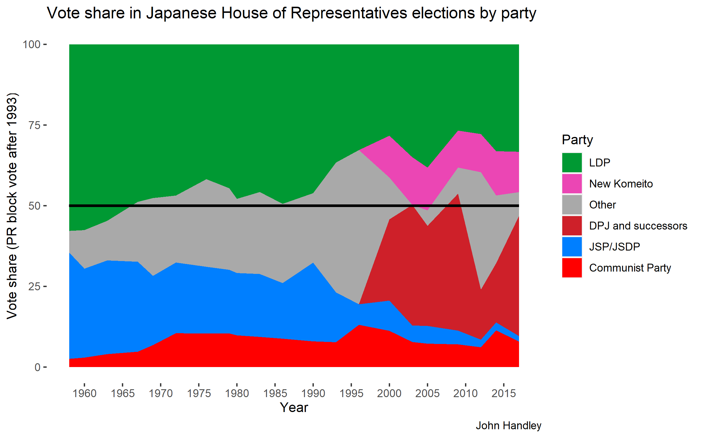
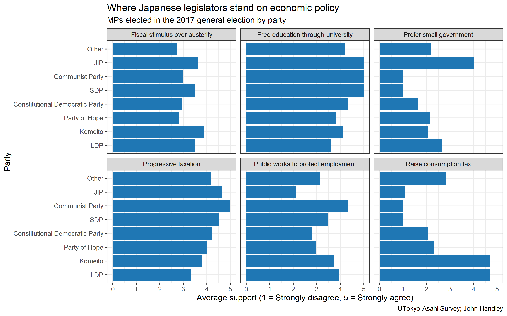
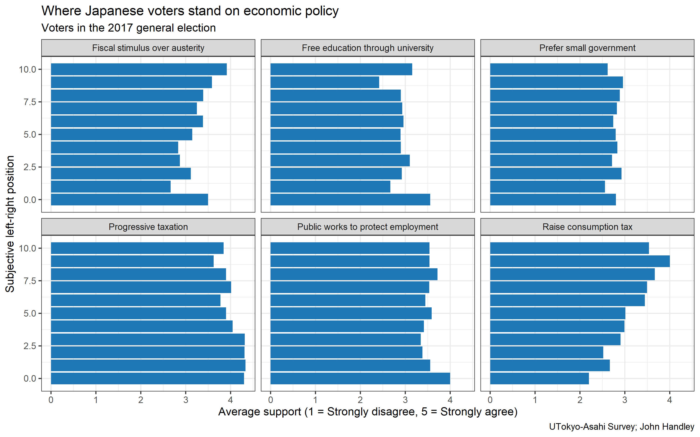
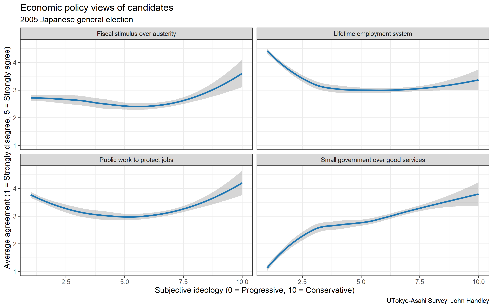
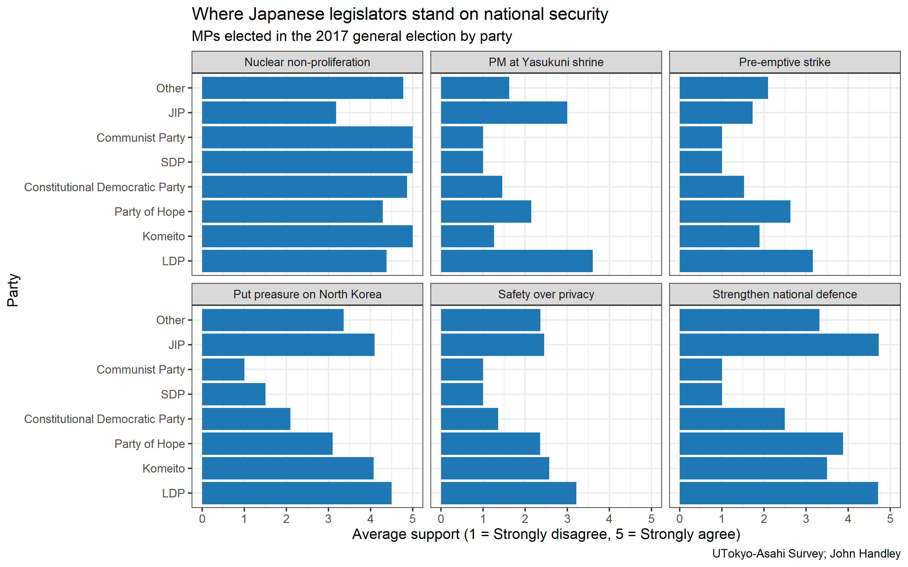
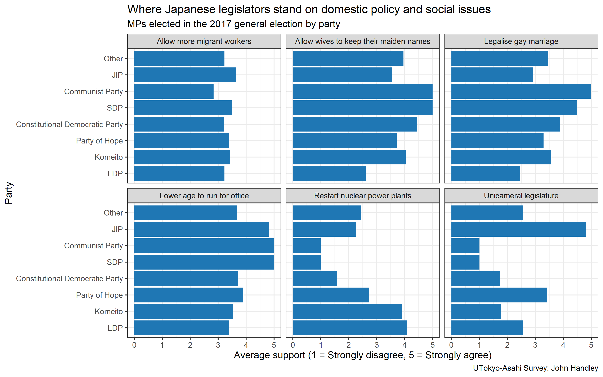

## The strength of the Liberal Democratic Party

The first thing most people learn about Japanese politics is the electoral dominance of the Liberal Democratic Party. Since it was founded in the 'conservative merger' (保守合同) in 1955, it has been only been out of power twice -- once after the 1993 general election when a group of opposition parties formed the first 'non-LDP, non-Communist' coalition government and again after the 2009 general election when the Democratic Party of Japan (DPJ) defeated the LDP in the aftermath of the global financial crisis. Both of these periods in opposition were also exceedingly short. The non-LDP, non-Communist coalition of the 1993 election lasted only for 8 months before the long-time main opposition Socialist Party agreed to form a coalition with the LDP in exchange for getting to appoint the prime minister. The DPJ-led coalition government fell apart within a year as well when the Social Democratic Party (the much-diminished continuation of the Socialist Party) left the coalition over Prime Minister Hatoyama's inability to get the US to move the Futenma military base in Okinawa out of the prefecture (最低でも県外). The DPJ had an overwhelming majority in the House of Representatives, so it was able to hold onto power for another two years, but poor handling of the 3/11 earthquake and Fukushima Dai-ichi nuclear plant meltdown as well as Prime Minister Noda's decision to violate the DPJ manifesto and raise consumption tax doomed them to defeat by the LDP in the 2012 general election. 

There are a number of explanations for why the LDP has been so effective at holding onto power: the supposed lack of social strife brought by Japan's homogenous population, the inherent conservatism of Japanese culture and people, the LDP's close ties with the powerful government bureaucracy, the prevalence of 'political dynasties' and particularistic appeals of many LDP politicians are all major contenders. While I don't have problems with these theories as such (although the first two are roughly equal parts lazy and inaccurate descriptions of Japanese society), I think they ignore the role that Japan's opposition parties have played both under the 55 system of vaguely two-party competition between the LDP and the Socialist Party and the tumultuous post-1993 party system. Why should we care about parties that have almost never been credible challenges to LDP governance? Well, most importantly, for all the LDP's legislative dominance it has rarely commanded close to a majority of the popular vote in mostly elections since 1970:

Looking at this chart, we are faced with the fact that political parties other than the LDP (and Komeito after 1999) are actually fairly popular -- the precursors to the current four main opposition parties (the Constitutional Democratic Party, the Democratic Party for the People, the Communist Party and the Social Democratic Party) garnered a combined 47% of the party list vote to the governing coalition's 46% in the 2017 general election. This isn't the first time this has happened either: in the 2003 general election, the DPJ actually beat the LDP in party-list votes 37% to 35% and in the 2009 general election they got nearly 60% more votes than the LDP. This is not to paint an overly rosy picture of the Japanese opposition. Their seat counts speak for themselves. But it does show that there are plenty of Japanese people willing to vote for a party that's not the LDP. This is why I think no analysis of Japanese politics is complete without proper consideration of *all* the options presented to the Japanese public, not just the internal politics of the LDP.

## Ideological divisions in Japanese politics

For this post, I want to focus specifically on the ideological views of each of the main political political parties. This is a big departure from the frequent sociological analyses of Japanese politics (such as arguments based on the homogenous society or conservative culture) and ones based on personalistic connections between MPs and their communities. While I think there are important lessons to be learned from looking at how social class, age, gender, trade union membership, etc. affect vote choice in Japan, I don't think any of these provide insight into the divisions of the main opposition parties which are most due to strong differences of opinion among party elites and not different social bases of support. Similarly, accounts of Japanese politics that revolve around the links between MPs and their communities are increasingly irrelevant since the switch from single non-transferable vote elections to the parallel system in 1994 -- parties no longer have to get voters to split evenly between multiple candidates and voters no longer need to heed differences between candidates of the same party. For Prime Minister Koizumi's claim that he'd "break the LDP" (自民党をぶっ壊す) in the 2005 election, to the cycling between three prime minister's from each faction of the party (Hatoyama from the centre, Kan from the left, and Noda from the right) during the 2009-2012 DPJ government, to Tokyo governor Koike's decision to "exclude" (排除) liberal DPJ MPs from her new opposition party in 2017, many of the movements in Japanese politics in the last decade and a half have been driven at least as much by top-down ideological debates between party elites as by bottom-up changes in the bases of party support or by a changing balance of LDP factions.

So what are the ideological splits in Japanese politics? First, I'll give a quick overview of the current state of the party system.

### The government

- **Liberal Democratic Party (自由民主党)**
  - Centre-right to right-wing
  - Famously composed of many factions, ranging from fairly liberal-leaning Thursday Club (木曜会) to the conservative Seiwa Policy Research Club (清和政策研究会)
- **Komeito (公明党)**
  - Centre to centre-right
  - Formerly the political arm of the new Buddhist sect Souka Gakkai (創価学会), it has since officially severed ties because of complaints that it violated the separation of Church and State in the Japanese constitution
  - Tends to push for greater welfare spending and Keynesian economics, even beyond the level of many of the opposition parties

### The opposition

* **Constitutional Democratic Party (立憲民主党)**
  * Centre-left
  * The liberal faction of the former Democratic Party that Tokyo Governor Koike excluded when then leader of the DPJ announced plans to join her new party "The Party of Hope" (希望の党)
  * The "constitutional" prefix is a reference to their opposition to amending the constitution, the reason Koike excluded them in the first place
* **Democratic Party for the People (国民民主党)**
  * Centre to centre-right
  * The conservative faction of the former Democratic Party.
  * They fought the 2017 election as "Party of Hope", but after failing to become the official opposition (let alone defeat the LDP), they reverted to being "Democratic"
  * Currently in talks with the Constitutional Democratic Party to merge
* **Social Democratic Party (社会民主党)**
  * Centre-left to left-wing
  * The Socialist Party changed its name 1996 to the Social Democratic Party
  * Even more opposed to constitutional change than the Constitutional Democratic Party
* **Communist Party (共産党)**
  * Left-wing
  * Similar to the Social Democratic Party, but has always had its own separate existence and support base
  * Until fairly recently, it was excluded from government by all parties, but it has been working more closely with the three other major opposition parties

### The 'govposition'

* **Japan Innovation Party (日本維新の会)**
  * Libertarian right-wing
  * Based off of a regional party from Osaka, the JIP has an eclectic set of policies that mean it doesn't side with the government or opposition
  * In Japanese, it has the nickname yu-to (ゆ党) since it is neither government, yo-to (与党), nor opposition, ya-to (野党)
  * In many ways it is the most right wing party in the Diet

I could go from here with a long discussion of the ideological and philosophical underpinnings of each party, but instead I'm going to introduce some hard data. Since the 2003 election, the University of Tokyo and Asahi Newspaper have collaborated on a survey of candidates in Japanese elections, and each time they ask several questions about the policy preferences of the candidates for various political issues. I have tabulated responses from MPs elected in the 2017 general election for 18 different areas:

* Economics
  * Preference for fiscal stimulus over austerity
  * Support for making all education from pre-school to university free
  * Preference for small government even at the expense of services
  * Support for progressive taxation
  * Support for using public works to protect employment
  * Support raising consumption tax in October 2019
* National Security and Foreign Affairs
  * Support for nuclear non-proliferation
  * Support for the prime minister worshipping at Yasukuni Shrine (to honour Japanese soldiers who died in the second world war, some of whom were class-A[^1] war criminals)
  * Support for a pre-emptive strike against potential attackers
  * Preference for putting pressure on North Korea instead of diplomacy
  * Willingness to accept curbs on privacy in exchange for greater security
  * Support for strengthening national defence
* Domestic policy and social issues
  * Support allowing more immigrant workers
  * Support allowing wives to keep their maiden names
  * Support for legalising gay marriage
  * Support for lowering the minimum wage for running for office
  * Support for restarting the nuclear power plants shut down after the Fukushima Dai-ichi meltdown
  * Prefer a unicameral legislature to the current bicameral one

Based on how the MPs for each party responded to all of these question, we can gauge what the issues that divide present-day Japanese politics are. What follows shouldn't be a huge surprise to Japanese readers (or people who are familiar with Japanese politics), but should showcase how the ideological divides in Japanese politics are fundamentally different from those present in Europe and North America and -- hopefully -- help to explain why the opposition has so much trouble uniting and how it takes exceptional circumstances to get the LDP out of government. I'll show the most important chart first. Here's how Japanese politicians answered the six economics questions:

## Economic policy

As you can see, some of the areas follow the expected pattern -- the further left the party, the more likely its MPs support progressive taxation and oppose small government, for example. The Japan Innovation Party's status as a 'govposition' party is also clear: it sides more with the opposition parties on education policy, progressive taxation, and opposition to increasing consumption tax, but its members are also the only ones who prefer a small government and the least likely to favour public works to protect employment. There's also some strange variation within the opposition parties on fiscal stimulus and public works. Support for public works follows a bow shape -- the Communists and the LDP are the supportive, the Constitutional Democratic Party and the Party of Hope (now the Democratic Party for the People) are the least. The CDP and Party of Hope are also the most bearish on fiscal stimulus.

People who know recent developments in Japanese politics well will suggest that this weird pattern is explained by the fact that Abe has ran on an economic policy that incorporates fiscal stimulus to increase the growth rate of nominal GDP -- 'Abenomics' -- and so the governing parties LDP and Komeito only support those things because of Abe's blatant attempt to co-opt the left on economics. I have two pieces of evidence against this. First, the same survey asked these questions to the Japanese public shortly before the election, and had a question for subjective left-right ideology. Based on this, we can see how self-identifying right-wingers think about economic policy and not just LDP MPs who have to support the party line.

As you can see here, the furthest left voters (0 on the subjective ideology scale) are indeed highly supportive of fiscal stimulus, but for everyone else the correlation actually runs opposite to what you would expect. In general, the more right wing you are in Japan the more likely you are to favour fiscal stimulus over austerity. For most of the other policies the picture is a slightly different one -- whether it's free education, small vs. big government, progressive taxation, or using public works to protect employment, most Japanese people conform to a broadly centre-left or left-wing position. The one major exception is consumption tax, which right-wing respondents favour raising and left-wing respondents oppose raising. I will return to this point later, but it indicates a tendency in Japanese politics for parties to coalesce around support for or opposition to a single politicised issue (such as whether to raise consumption tax or whether to restart nuclear power plants) rather than competition between competing political programmes from opposing ideological poles.

Back to the point of patterns of support for fiscal stimulus and public works, my second piece of evidence comes from when the same question was asked of candidates in the 2005 general election. This was before Abenomics, and indeed at a time when the LDP, led my Prime Minister Koizumi, was enacting a series of neoliberal supply-side reforms aimed at, among other things, reducing Japan's sizeable fiscal deficit.

Here you can see that even in 2005, fiscal stimulus and public works were more supported by the right (and somewhat by the far left) than by the centre and centre-left. The Japanese left has been anti-Keynesian for at least a decade and a half. 

The economic policy divides in Japanese politics can be summarised with a coupe of points:

- There is a low level of polarisation on most questions of principle
- Specific policies that have been politicised for a long time (i.e., consumption tax -- which has been on the political agenda since the late 80s) are the only real exceptions
- When it comes to economic intervention as a whole, the far left sometimes has more in common with the right than the centre and centre-left

These three facts help to create a political environment where economic debates do not really shape politics. It's not a grand battle over redistribution like (the idealised view of post-war) European politics.

## National security and foreign affairs

If not economics, then what is Japanese political competition about? I hope to show in this section that, following the constitutional debate that has been going on in Japan since the current constitution was put into effect in 1947, views on Japanese national security and its relationships with America and neighbouring East Asian countries are the primary factor. Once again, I'll show how MPs elected in 2017 responded to the questions I listed above:

Aside from nuclear non-proliferation, politicians' views on these issues are *much* more polarised along party lines. Hawkishness on North Korea is almost a straight line from left to right (perhaps exaggerated because North Korean missile tests were a key issue in the 2017 election campaign) and the same goes for tolerating privacy violations in order to have better national security. Views on strengthening national defence, whether the prime minister should worship at Yasukuni shrine (an activity hated by Korea and China), and support for pre-emptive strikes are important exceptions -- the Party of Hope/Democratic Party for the People is actually to the right of Komeito on this, sometimes nearing the LDP in hawkishness. This may in part be because of Governor Koike's infamous exclusion of MPs opposed to constitutional reform, but as we shall see in the next section it's not limited to just foreign policy. That being said, foreign policy (specifically the way Japan handles national defence and its legacy from the second world war) has been the defining issue of Japanese politics for decades. Despite the main opposition of the 55 system being the Socialist Party (indeed a Socialist Party committed to a 'peaceful revolution' and opposed to the welfare state on Marxist grounds)[^2], the main tangible political aim of the left was to stop the LDP from reforming the "Peace Constitution" (平和憲法) to allow for re-militarisation. This key debate filters through to today, where one of the Communist Party's most prominent posters is of a woman carrying a flag that says "Let's protect Article 9 of the Constitution" and "Stop! Abe's constitutional reform".

## Domestic policy and social issues

The final set of policies I want to highlight are fairly broad, but I think they all roughly fit into the category of domestic policy and social issues. This ranges from positions on restarting nuclear power plants (polarised in a similar way as consumption tax is) to whether gay marriage should be legalised.

These issues are somewhere in between economics and national security in terms of polarisation. There are two interesting features. When it comes to separate names for spouses and legalising gay marriage, Komeito is arguably closer to the opposition parties than it is to the LDP. Also, The Party of Hope shows its conservatism by being the least likely opposition party to support either of these policies. Support for switching to a unicameral legislature is another peculiar area: the Japan Innovation Party is strongly supportive (part of its overall programme of cutting government operating expenses, 身を切る改革), but the Party of Hope is the only other party that's at least neutral. This reflects the Japanese centre's support for "reform centrism" (改革中道), an idea espoused by current Democratic Party for the People leader Tamaki Ichiro. 

## The three axes of division in the Japanese opposition

In the last three sections, I have pinpointed three main areas where the Japanese opposition parties are actually not in agreement. First, the former DPJ has ingrained opposition to Keynesianism that prevents them from effectively uniting with the left to present a left-wing alternative to Abenomics. Second, the right-wing for the former DPJ (Party of Hope/Democratic Party for the People) is too hawkish on foreign policy and too willing to consider constitutional reform to present a united pro-pacifism opposition. Finally, the opposition parties are divided on their support for reforms to the "Japanese system" (indicated here with the unicameralism question, but also present in the contrast between DPFP's 'reform centrism' ideology and the rest of the opposition). In fact, in some ways the Communist Party and the Social Democratic Party are deeply conservative parties, with the Constitutional Democratic Party taking a similar tack. They want to preserve the constitution, to return to the old tax structure (more corporation tax, less consumption tax) whereas the DPFP is much more aligned with the reformist agenda presented by ex-LDP politicians like Ozawa Ichiro after the collapse of the 55 system.[^3] These divisions help to explain not just the rupture in the party system before the 2017 general election, but also the decisions made during the 2009-2012 DPJ government. The SDP left the coalition over a foreign policy disagreement, Prime Minister Kan was forced out by the right of the DPJ, and Prime Minister Noda legislated consumption tax increases and raised tax to pay for disaster recovery because opposition to Keynesianism overruled opposition to consumption tax increases from the other end of the party. They even backtracked on their one major benefit expansion -- simplifying family benefits into a single universal Child Benefit (子ども手当) -- because of a combination of 'reform centrism' being opposed to a mixed strategy that includes in-kind benefits for childcare and because of a misplaced desire to balanced budgets.[^4] This leaves us with a question: if the Japanese opposition parties are so divided, is there any hope for the future?

## Conclusion: is there any hope for a future non-LDP government?

My answer to this question is a (very) qualified "yes". I think the last three years have been a way for the liberal and conservative wings of the Democratic Party to stay apart and get over the bitterness that had been festering since the beginning of their time in government. The Constitutional Democratic Party and the Democratic Party for the People have also recently announced plans for a merger, so this is an indication that the bad times of divided opposition are over. This is especially true because of the "opposition cooperation" (野党共闘) that includes the Social Democratic Party and even the long-excluded Communist Party. Whether this alliance can command the support of the public, especially in an environment where the combined support for the four opposition parties is 8.2% to the LDP's 32.2% and "none of the above" (支持政党なし)'s 45.5% in the latest NHK poll, remains to be seen. With Abe's popularity falling due to his handling of Coronavirus and the end of his term rapidly approach with no clear successor, it's possible that Japan's vast non-partisan (無党派) group will finally be ready to seriously consider an alternative to Abe after seven years. I'm not terribly optimistic, but in the hope of a Japanese government that is serious about taking a radical approach to tackling wage stagnation, poverty, long working hours, the fertility crisis and the looming pensioner poverty crisis I can't help but hope for a strong opposition.

[^1]: At the Tokyo War Crimes Tribunal after the second world war, Japanese defendants were classified into three categories: Class A (crimes against peace), Class B (war crimes), and Class C (crimes against humanity, such as those committed by Japanese soldiers in Nanking)
[^2]: These were key arguments in the Japanese Socialist Party's platform from 1964 to 1986: 「日本における社会主義への道」 ("he Road to Socialism in Japan"), you can read in detail about the internal politics of the Japanese Socialist Party (in Japanese) here: https://www.soc.hit-u.ac.jp/~takujit/course-of-faculty/2010seminar/yamazaki2010.html
[^3]: He published his plans in a book called 「日本改造計画」(in reference to his mentor, former PM Tanaka Kakuei's 「日本列島改造論」) or, in English, "Blueprint for a New Japan: the rethinking of a nation"
[^4]: A good resource for this (sadly also in Japanese) is 「2つの政権交代　政策は変わったのか」("The two changes of government: did policy change?")